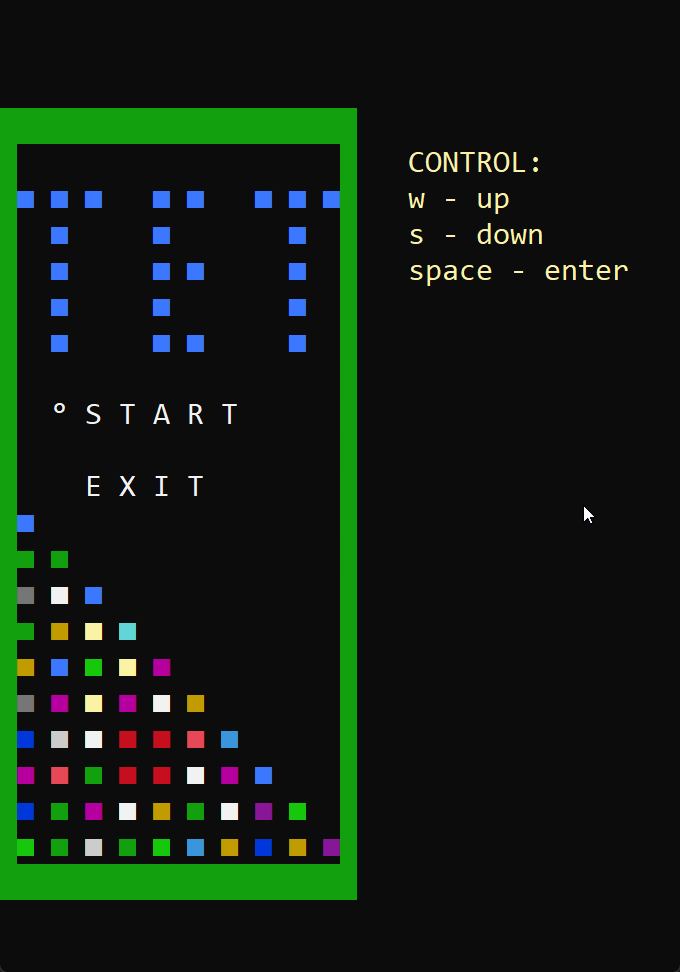

# Project Tetris

### The purpose of project:
Make a copy of the tetris game in the Windows Console without using third-party libraries

### Technology stack:
- C++17
- The project is optimized for Microsoft Visual Studio

### System requirements:
- Works only Windows 7 and higher

### Quick setup:
1. Clone a project
2. Open `tetris.sln` file by Microsoft Visual Studio
3. Set the `c++17 `version in Visual Studio
4. Set up Visual Studio by this video: [Click here](https://www.youtube.com/watch?v=HExn9oTqdVo&t=558s)

## Game demo:

.
